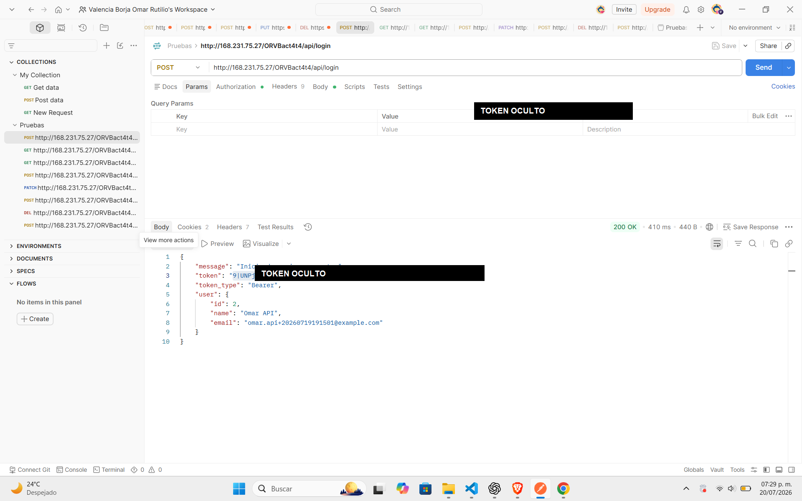
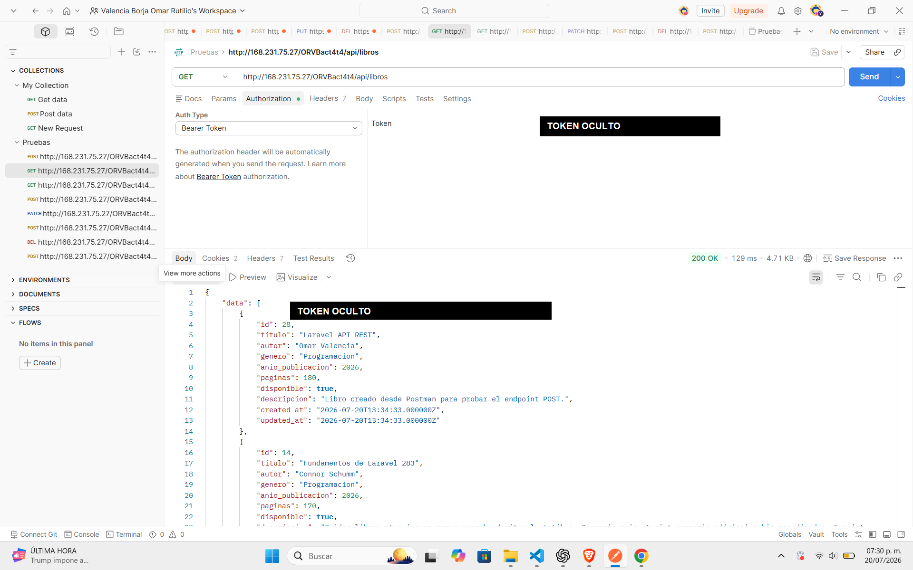
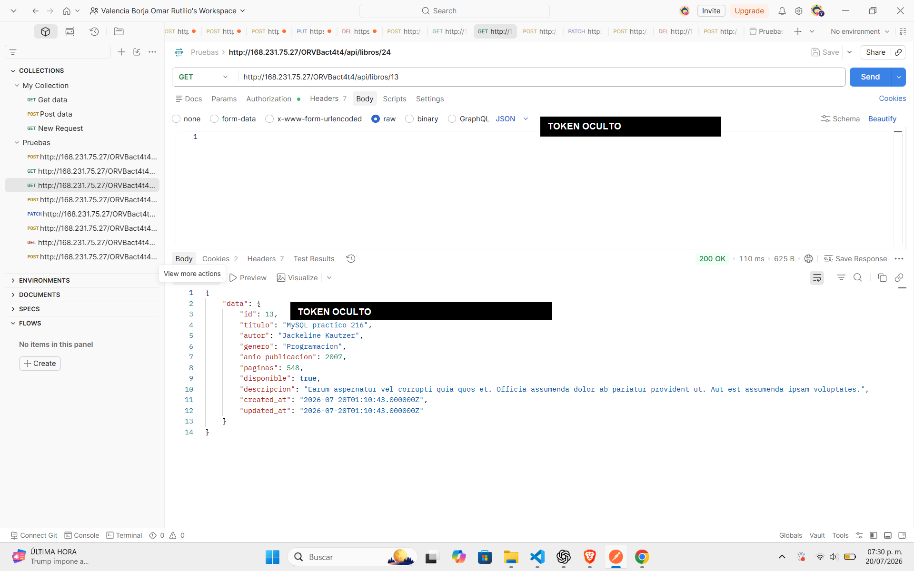
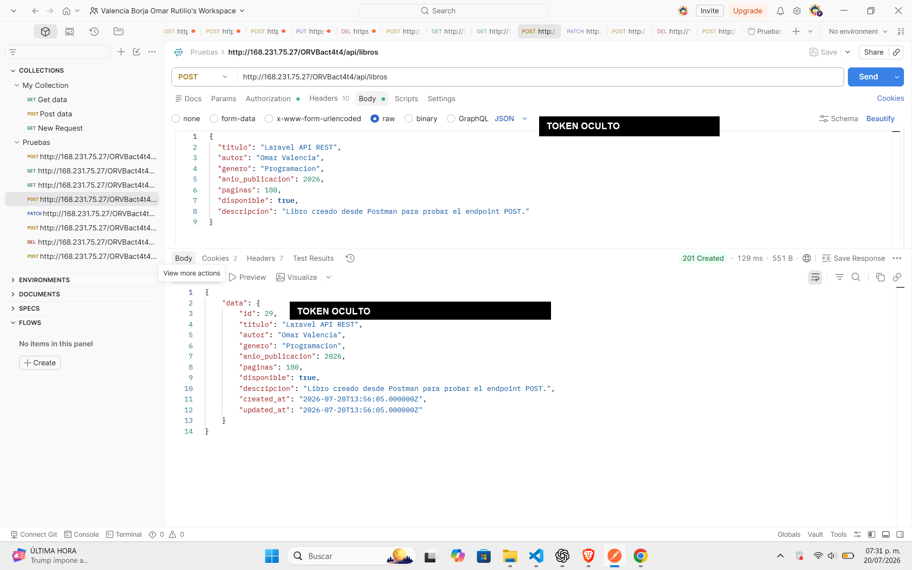
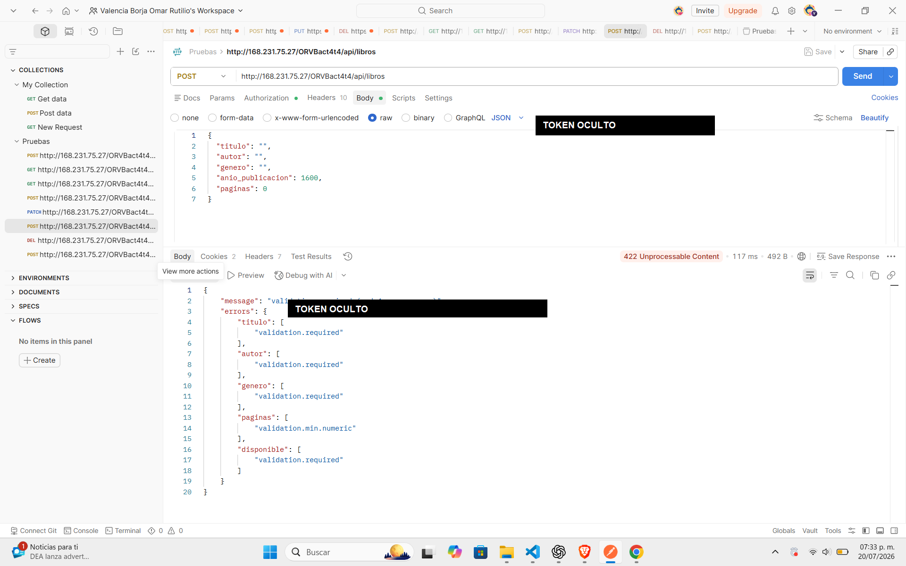
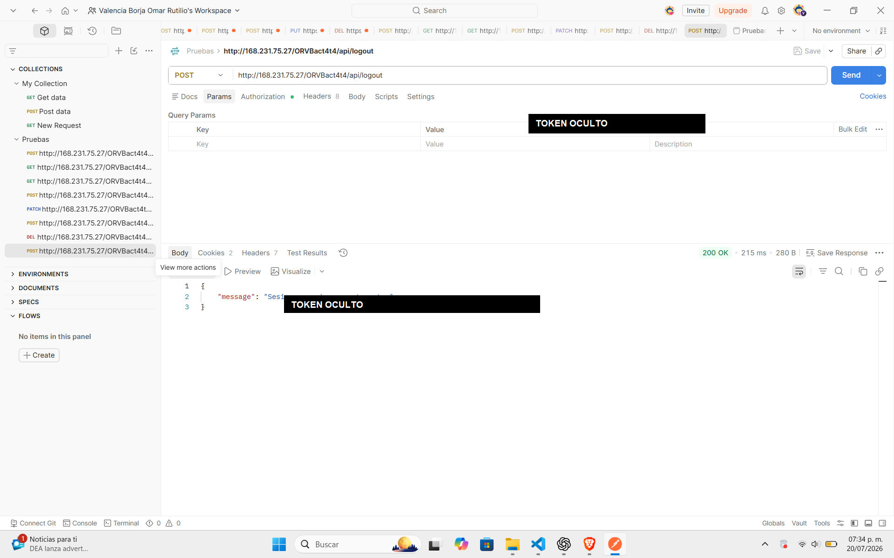

# ORVBact4_t4 - API REST Laravel con Sanctum

Proyecto backend para la actividad 4 del tema 4. La aplicacion es una API REST construida en Laravel 12, con autenticacion real mediante Laravel Sanctum, rutas en `routes/api.php`, respuestas JSON, validacion de datos y API Resources.

## Objetivo

Construir una API protegida por tokens para administrar una entidad mediante CRUD completo. Esta actividad solo incluye backend; el frontend con React se conectara en una actividad posterior.

## Entidad del CRUD

La entidad elegida fue `Libro`.

Campos:

- `id`
- `titulo`
- `autor`
- `genero`
- `anio_publicacion`
- `paginas`
- `disponible`
- `descripcion`
- `created_at`
- `updated_at`

## Autenticacion con Sanctum

La API usa Laravel Sanctum con tokens personales.

Endpoints publicos:

```text
POST /api/register
POST /api/login
```

Endpoints protegidos con `auth:sanctum`:

```text
GET    /api/user
POST   /api/logout
GET    /api/libros
POST   /api/libros
GET    /api/libros/{libro}
PUT    /api/libros/{libro}
PATCH  /api/libros/{libro}
DELETE /api/libros/{libro}
```

Para acceder a las rutas protegidas se debe enviar el token:

```http
Authorization: Bearer TOKEN_GENERADO
Accept: application/json
```

## API Resources

El proyecto usa `LibroResource` para controlar el formato JSON de salida. Esto evita exponer informacion innecesaria o sensible y mantiene una estructura clara en las respuestas.

Ejemplo de respuesta:

```json
{
  "data": {
    "id": 1,
    "titulo": "Fundamentos de Laravel 10",
    "autor": "Omar Valencia",
    "genero": "Backend",
    "anio_publicacion": 2025,
    "paginas": 320,
    "disponible": true,
    "descripcion": "Libro de practica para construir APIs.",
    "created_at": "2026-07-20T00:00:00.000000Z",
    "updated_at": "2026-07-20T00:00:00.000000Z"
  }
}
```

## Validacion

Las peticiones de crear y actualizar usan Form Requests:

- `StoreLibroRequest`
- `UpdateLibroRequest`

Si los datos no cumplen las reglas, Laravel responde en JSON con codigo `422`.

## Paginacion

El listado usa paginacion:

```php
Libro::latest()->paginate(10);
```

Endpoint:

```text
GET /api/libros?page=1
```

## Pruebas con Postman y Bruno

La coleccion de Bruno esta incluida en:

```text
bruno/
```

Tambien se incluye una coleccion exportada de Postman en:

```text
postman/ORVBact4_t4.postman_collection.json
```

Incluye peticiones para:

- Registro
- Login
- Consultar usuario autenticado
- Probar ruta protegida sin token
- Listar libros con paginacion
- Ver un libro
- Crear libro
- Actualizar libro
- Eliminar libro
- Logout

## Evidencias de pruebas en Postman

Las siguientes capturas muestran la API funcionando en el VPS. Las pruebas se realizaron usando el token Bearer generado por Sanctum. Por seguridad, el token se oculta en las imagenes antes de subirlas al repositorio.

### 1. Login y generacion de token



La peticion `POST /api/login` valida las credenciales del usuario y devuelve un token de acceso real generado por Laravel Sanctum. Este token se usa despues en el encabezado `Authorization: Bearer TOKEN` para consumir las rutas protegidas.

### 2. Listar libros con autenticacion



La peticion `GET /api/libros` devuelve el listado de libros en formato JSON. Esta ruta esta protegida con `auth:sanctum`, por eso solo funciona cuando se envia un token valido.

### 3. Consultar un libro individual



La peticion `GET /api/libros/{id}` permite consultar un solo registro. En la respuesta se observa que el resultado viene dentro de la clave `data`, usando el `LibroResource` para controlar el formato del JSON.

### 4. Crear un libro



La peticion `POST /api/libros` crea un nuevo libro con los datos enviados en JSON. La API responde con `201 Created`, lo que confirma que el registro se inserto correctamente en la base de datos.

### 5. Actualizar un libro


La peticion `PATCH /api/libros/{id}` actualiza parcialmente un libro existente. En la captura se modifican campos como `titulo`, `paginas` y `disponible`, y la API responde con `200 OK`.

### 6. Eliminar un libro


La peticion `DELETE /api/libros/{id}` elimina un registro. La respuesta `204 No Content` indica que la operacion se completo correctamente y que no es necesario devolver cuerpo en la respuesta.

### 7. Validacion de datos con error 422



Esta es una de las pruebas mas importantes de la actividad. Se envia una peticion `POST /api/libros` con datos invalidos: campos vacios, paginas en `0` y sin el campo `disponible`. Laravel rechaza la peticion y responde `422 Unprocessable Content` con un JSON de errores.

Esto demuestra que la API no acepta cualquier dato, sino que valida la informacion antes de crear registros. Los errores aparecen por campo, por ejemplo:

- `titulo`: requerido
- `autor`: requerido
- `genero`: requerido
- `paginas`: debe cumplir el minimo numerico
- `disponible`: requerido

### 8. Cierre de sesion



La peticion `POST /api/logout` invalida el token actual. Despues de cerrar sesion, ese token ya no puede usarse para acceder a las rutas protegidas y las peticiones vuelven a responder `401 Unauthenticated`.

## Instalacion local

```bash
git clone https://github.com/omarferxoo/ORVBact4_t4.git
cd ORVBact4_t4
composer install
cp .env.example .env
php artisan key:generate
php artisan migrate:fresh --seed
php artisan serve
```

## Despliegue en VPS

La API se despliega en Nginx apuntando a la carpeta `public/` del proyecto.

Ruta esperada en VPS:

```text
/var/www/html/ORVBact4t4/
```

URL de la API:

```text
http://168.231.75.27/ORVBact4t4/api
```

## Seguridad

El archivo `.env` no se sube al repositorio porque contiene credenciales y configuracion sensible. La carpeta `vendor/` tampoco se sube; se instala con Composer.
